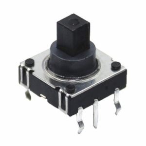

## Controls

 

---
- [Buttons](#buttons)
- [Encoders](#encoders)
- [IR receiver](#ir-receiver)
- [Joystick](#joystic)
- [Back to README](README.md)

---
### Buttons
Up to 5 buttons can be connected to the device. Three buttons are enough to control it.

Button actions:
- BTN_LEFT\
 click: volume down\
 dblclick: previous station\
 longpress: quick volume down
- BTN_CENTER\
 click: start/stop playing\
 dblclick: toggle between PLAYER/PLAYLIST mode\
 longpress: toggle between PLAYER/PLAYLIST mode
- BTN_RIGHT\
 click: volume up\
 dblclick: next station\
 longpress: quick volume up
- BTN_UP\
 click: without display - next station, with display - move up\
 dblclick: doing nothing\
 longpress: with display - quick move up
- BTN_DOWN\
 click: without display - prev station, with display - move down\
 dblclick: doing nothing\
 longpress: with display - quick move down

---
### Encoders
You can connect one or two encoders to replace/complete the buttons. One encoder (without buttons) is enough to control the device.

- ENCODER1\
 rotate left: (ENC_BTNL) in PLAYER mode - volume down, in PLAYLIST mode - move up\
 rotate right: (ENC_BTNR) in PLAYER mode - volume up, in PLAYLIST mode - move down\
 click, dblclick, longpress: (ENC_BTNB) same as BTN_CENTER
- ENCODER2\
 rotate left: (ENC2_BTNL) if not pressed - switch to PLAYLIST mode and move up, if pressed - volume down\
 rotate right: (ENC2_BTNR) if not pressed - switch to PLAYLIST mode and move down, if pressed - volume up\
 click, dblclick: (ENC2_BTNB) same as BTN_CENTER

---
### IR receiver
- IR_CODE_PLAY: start/stop playing
- IR_CODE_PREV: previous station
- IR_CODE_NEXT: next station
- IR_CODE_VOLUP: volume up, longpress - quick volume up
- IR_CODE_VOLDN: volume down, longpress - quick volume down
- IR_CODE_HASH: toggle between PLAYER/PLAYLIST mode
- IR_CODE_NUM0-NUM9:\
 Start entering the station number. To finish input and start playback, press the play button. To cancel, press hash.

---
### Joystick
You can use a joystick [like this](https://aliexpress.com/item/4000681560472.html) instead of connecting five buttons

 

---
