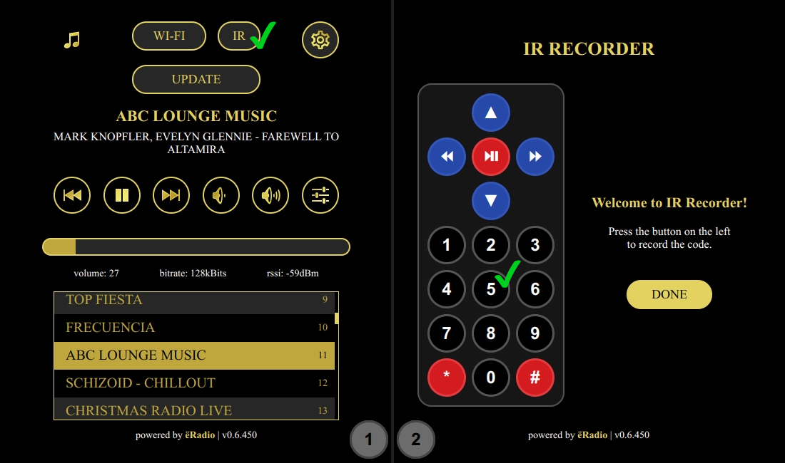
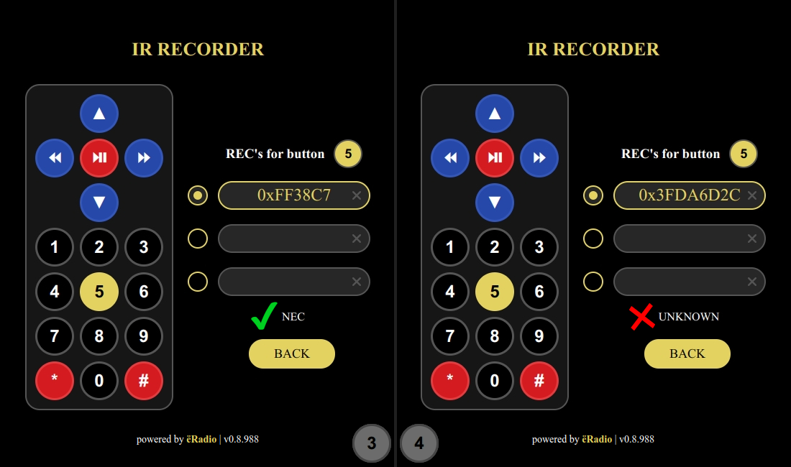

## Controls

 

---
- [Buttons](#buttons)
- [Encoders](#encoders)
- [IR receiver](#ir-receiver)
- [Joystick](#joystick)
- [Touchscreen](#touchscreen)
- [Back to README](README.md)

---
### Buttons
Up to 5 buttons can be connected to the device. Three buttons are enough to control it.

Button actions:
- BTN_LEFT\
 click: volume down\
 dblclick: previous station\
 longpress: quick volume down
- BTN_CENTER\
 click: start/stop playing\
 dblclick: switch SD/WEB mode\
 longpress: toggle between PLAYER/PLAYLIST mode
- BTN_RIGHT\
 click: volume up\
 dblclick: next station\
 longpress: quick volume up
- BTN_UP\
 click: without display - next station, with display - move up\
 dblclick: doing nothing\
 longpress: with display - quick move up
- BTN_DOWN\
 click: without display - prev station, with display - move down\
 dblclick: doing nothing\
 longpress: with display - quick move down
- BTN_MODE\
 click: switch SD/WEB mode\
 longpress: go to sleep
 
---
### Encoders
You can connect one or two encoders to replace/complete the buttons. One encoder (without buttons) is enough to control the device.

- ENCODER1\
 rotate left: (ENC_BTNL) in PLAYER mode - volume down, in PLAYLIST mode - move up\
 rotate right: (ENC_BTNR) in PLAYER mode - volume up, in PLAYLIST mode - move down\
 click, dblclick, longpress: (ENC_BTNB) same as BTN_CENTER
- ENCODER2\
 rotate left: (ENC2_BTNL) if not pressed - switch to PLAYLIST mode and move up, if pressed - volume down\
 rotate right: (ENC2_BTNR) if not pressed - switch to PLAYLIST mode and move down, if pressed - volume up\
 click, dblclick: (ENC2_BTNB) toggle between PLAYER/VOLUME mode

---
### IR receiver
Starting from version 0.6.450, adding an IR remote control has been moved to the web interface. Can be added for up to three remotes.
1. go to Settings - IR (fig.1)
2. press the button you need on the left to record the IR code (fig.2)

 

3. select the slot on the right and press the button on the physical IR remote (fig.3). Avoid the inscription "UNKNOWN" (fig.4)

 

4. repeat steps 2 and 3 for other buttons
5. select BACK, select DONE

**Button assignment:**
- &#9199; - start/stop playing
- &#9194; - previous station
- &#9193; - next station
- &#9650; - volume up, longpress - quick volume up
- &#9660; - volume down, longpress - quick volume down
- &nbsp;**\#**  &nbsp;- toggle between PLAYER/PLAYLIST mode
- **0-9** - Start entering the station number. To finish input and start playback, press the play button. To cancel, press hash.

---
### Joystick
You can use a joystick [like this](https://aliexpress.com/item/4000681560472.html) instead of connecting five buttons

 

---
### Touchscreen
- Swipe horizontally: volume control
- Swipe vertically: station selection
- Tap: in PLAYER mode - start/stop playback, in PLAYLIST mode - select
- Long tap: in PLAYLIST mode - cancel

---
