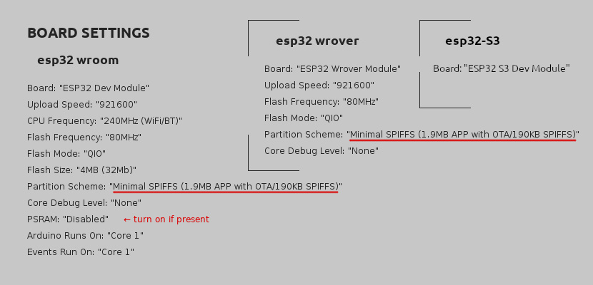
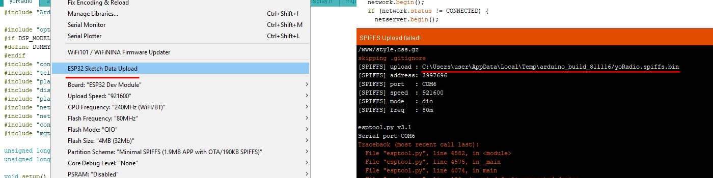
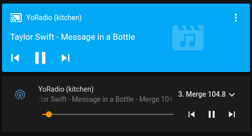
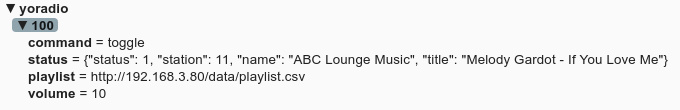

# ёRadio


##### Web-radio based on [ESP32-audioI2S](https://github.com/schreibfaul1/ESP32-audioI2S) or/and [ESP32-vs1053_ext](https://github.com/schreibfaul1/ESP32-vs1053_ext) library
---
- [Hardware](#hardware)
- [Connection tables](#connection-tables)
- [Software dependencies](#dependencies)
- [Hardware setup](#hardware-setup)
- [Quick start](#quick-start)
- [Update](#update)
- [Update over web-interface](#update-over-web-interface)
- [Controls](Controls.md)
- [MQTT](#mqtt)
- [Home Assistant](#home-assistant)
- [More features](#more-features)
- [Plugins](#plugins)
- [Version history](#version-history)
---


##### More images in [Images.md](Images.md)

---
## Hardware
#### Required:
**ESP32 board**: https://aliexpress.com/item/32847027609.html \
**I2S DAC**, roughly like this one: https://aliexpress.com/item/1005001993192815.html \
https://aliexpress.com/item/1005002011542576.html \
or **VS1053b module** : https://aliexpress.com/item/32893187079.html \
https://aliexpress.com/item/32838958284.html \
https://aliexpress.com/item/32965676064.html

#### Optional:
##### Displays
- **ST7735** 1.8' or 1.44' https://aliexpress.com/item/1005002822797745.html
- or **SSD1306** 0.96' 128x64 I2C https://aliexpress.com/item/1005001621806398.html
- or **SSD1306** 0,91' 128x32 I2C https://aliexpress.com/item/32798439084.html
- or **Nokia5110** 84x48 SPI https://aliexpress.com/item/1005001621837569.html
- or **ST7789** 2.4' 320x240 SPI https://aliexpress.com/item/32960241206.html
- or **SH1106** 1.3' 128x64 I2C https://aliexpress.com/item/32683094040.html
- or **1602** 16x2 I2C https://aliexpress.com/item/32305776560.html
- or **1602** 16x2 without I2C https://aliexpress.com/item/32305776560.html
- or **SSD1327** 1.5' 128x128 I2C https://aliexpress.com/item/1005001414175498.html
- or **ILI9341** 3.2'320x240 SPI https://aliexpress.com/item/33048191074.html
- or **SSD1305 (SSD1309)** 2.4' 128x64 SPI https://aliexpress.com/item/32950307344.html
- or **SH1107** 0.96' 128x64 I2C https://aliexpress.com/item/4000551696674.html
- or **GC9106** 0.96' 160x80 SPI (looks like ST7735S, but it's not him) https://aliexpress.com/item/32947890530.html

##### Controls
- Three tact buttons https://www.aliexpress.com/item/32907144687.html
- Encoder https://www.aliexpress.com/item/32873198060.html
- Joystick https://aliexpress.com/item/4000681560472.html \
https://aliexpress.com/item/4000699838567.html
- IR Control https://www.aliexpress.com/item/32562721229.html \
https://www.aliexpress.com/item/33009687492.html
- Touchscreen https://aliexpress.com/item/33048191074.html

---
## Connection tables
| SPI Display | ESP-32 | options.h |
| ------ | ------ | ------ |
| GND | GND | - |
| VCC | +5v | - |
| SCL | 18 | - |
| SDA | 23 | - |
| CSL | 5* | TFT_CS |
| RSTL | 15* | TFT_RST |
| DCL | 4* | TFT_DC |

| NOKIA5110 | ESP-32 | options.h |
| ------ | ------ | ------ |
| RST | 15* | TFT_RST |
| CE | 5* | TFT_CS |
| DC | 4* | TFT_DC |
| DIN | 23 | - |
| CLK | 18 | - |
| VCC | +3v3 | - |
| GND | GND | - |

| I2C Display | ESP-32 | options.h |
| ------ | ------ | ------ |
| GND | GND | - |
| VCC | +5v | - |
| SDA | 13* | I2C_SDA |
| SCL | 14* | I2C_SCL |

| LCD 1602 | ESP-32 | options.h |
| ------ | ------ | ------ |
| GND | GND | - |
| VCC | +5v | - |
| RS | any* | LCD_RS |
| E | any* | LCD_E |
| D4 | any* | LCD_D4 |
| D5 | any* | LCD_D5 |
| D6 | any* | LCD_D6 |
| D7 | any* | LCD_D7 |

| Touchscreen | ESP-32 | options.h |
| ------ | ------ | ------ |
| GND | GND | - |
| VCC | +3.3v | - |
| CLK | 18 | - |
| DIN | 23 | - |
| DO | 19 | - |
| IRQ | N/C | - |
| CS | any* | TS_CS |

| I2S DAC | ESP-32 | options.h |
| ------ | ------ | ------ |
| GND       | GND | - |
| VIN       | +5v | - |
| DOUT(DIN) | 27* | I2S_DOUT |
| BCLK      | 26* | I2S_BCLK |
| LRC(WSEL) | 25* | I2S_LRC |

| VS1053 | ESP-32 | options.h |
| ------ | ------ | ------ |
| XDCS | 25* | VS1053_DCS |
| XCS | 27* | VS1053_CS |
| XRST | EN* | VS1053_RST |
| DERQ | 26* | VS1053_DREQ |
| SCK | 18 | - |
| MOSI | 23 | - |
| MISO | 19 | - |
| 5V | +5V | - |
| DGND | GND | - |

_\#\# Important! You must choose between I2S DAC and VS1053 by disabling the second module in the settings (see below)_

| Buttons, Encoder, LED, IR, Joystick | ESP-32 | options.h |
| ------ | ------ | ------ |
| GND       | GND | - |
| PIN       | any* | ENC_BTNx, BTN_xxx, LED_BUILTIN, IR_PIN  |

_\* Any free pin, configured in myoptions.h_ \
_\** GPIOs 34-39 don't have software pullup/down functions. For encoder/buttons use an external pullup resistor, 10 kOhm works here._ \
_\** GPIO 16 and 17 are used by PSRAM on the WROVER modules._

---
## Dependencies
#### Libraries:
**Library Manager**: Adafruit_GFX, Adafruit_ST7735\*, Adafruit_SSD1306\*, Adafruit_PCD8544\*, Adafruit_SH110X\*, Adafruit_SSD1327\*, Adafruit_ILI9341\*, Adafruit_SSD1305\*, (\* depending on display model), ESP32Encoder, OneButton, IRremoteESP8266, XPT2046_Touchscreen \
**Github**: [ESPAsyncWebServer](https://github.com/me-no-dev/ESPAsyncWebServer), [AsyncTCP](https://github.com/me-no-dev/AsyncTCP), [async-mqtt-client](https://github.com/marvinroger/async-mqtt-client)* \
\* _if you need MQTT support_

#### Tool:
[ESP32 Filesystem Uploader](https://randomnerdtutorials.com/install-esp32-filesystem-uploader-arduino-ide/)

---
## Hardware setup
Dont edit the options.h! \
Hardware is adjustment in the **[myoptions.h](exsamples/myoptions.h)** file.

**Important!**
You must choose between I2S DAC and VS1053 by disabling the second module in the settings:
````c++
// If I2S DAC used:
#define I2S_DOUT      27
#define VS1053_CS     255
// If VS1053 used:
#define I2S_DOUT      255
#define VS1053_CS     27
````
Define display model:
````c++
#define DSP_MODEL  DSP_ST7735 /*  default - DSP_DUMMY  */
````
The ST7735 display submodel:
````c++
#define DTYPE INITR_BLACKTAB // 1.8' https://aliexpress.ru/item/1005002822797745.html
//#define DTYPE INITR_144GREENTAB // 1.44' https://aliexpress.ru/item/1005002822797745.html
````
Rotation of the display:
````c++
#define TFT_ROTATE 3 // 270 degrees
````
##### Note: If INITR_BLACKTAB dsp have a noisy line on one side of the screen, then in Adafruit_ST7735.cpp:
````c++
  // Black tab, change MADCTL color filter
  if ((options == INITR_BLACKTAB) || (options == INITR_MINI160x80)) {
    uint8_t data = 0xC0;
    sendCommand(ST77XX_MADCTL, &data, 1);
    _colstart = 2; // ← add this line
    _rowstart = 1; // ← add this line
  }
````

---
## Quick start
<br />

0. **[Arduino core for the ESP32](https://github.com/espressif/arduino-esp32) v2.0.0 or higgest is required!**
1. In ArduinoIDE - upload sketch data via Tools→ESP32 Sketch Data Upload ([it's here](images/board2.jpg))
2. Upload the sketch to the board
3. Connect to yoRadioAP acces point with password 12345987, go to http://192.168.4.1/ configure and wifi connections.  \
_\*this step can be skipped if you add WiFiSSID WiFiPassword pairs to the [yoRadio/data/data/wifi.csv](yoRadio/data/data/wifi.csv) file (tab-separated values, one line per access point) before uploading the sketch data in step 1_
4. After successful connection go to http://\<yoipaddress\>/ , add stations to playlist (or import WebStations.txt from KaRadio)
5. Well done!

**Localization:**
Если Adafruit_GFX ещё не русифицирована, русифицировать её, заменив файл Arduino/libraries/Adafruit_GFX_Library/glcdfont.c файлом [yoRadio/fonts/glcdfont.c](yoRadio/fonts/glcdfont.c)

---
## Update
1. Backup your settings: \
download _http://\<yoradioip\>/data/playlist.csv_ and _http://\<yoradioip\>/data/wifi.csv_ and place them in the yoRadio/data/data/ folder
2. In ArduinoIDE - upload sketch data via Tools→ESP32 Sketch Data Upload
3. Upload the sketch to the board
4. Go to page _http://\<yoradioip\>/_ in the browser and press Ctrl+F5 to update the scripts.
5. Well done!

## Update over web-interface
1. Backup your settings: \
download _http://\<yoradioip\>/data/playlist.csv_ and _http://\<yoradioip\>/data/wifi.csv_ and place them in the yoRadio/data/data/ folder
2. Get firmware binary: Sketch → Export compiled binary
3. Get SPIFFS binary: disconnect ESP32 from your computer, click on **ESP32 Data Sketch Upload**. \
 You will get an error and file path
 
4. Go to page _http://\<yoradioip\>/update_ and upload yoRadio.ino.esp32.bin and yoRadio.spiffs.bin in turn, checking the appropriate upload options.
5. Well done!

---
## MQTT
1. Copy file exsamples/mqttoptions.h to yoRadio/ directory
2. In the mqttoptions.h file, change the options to the ones you need
3. Well done!

---
## Home Assistant
<br />

0. Requires [MQTT integration](https://www.home-assistant.io/integrations/mqtt/)
1. Copy directory HA/custom_components/yoradio to .homeassistant/custom_components/
2. Add yoRadio entity into .homeassistant/configuration.yaml ([see exsample](HA/exsample_configuration.yaml))
3. Restart Home Assistant
4. Add Lovelace Media Player card to UI (or [mini-media-player](https://github.com/kalkih/mini-media-player) card)
5. Well done!

---
## More features
- Сan add up to 65535 stations to a playlist. Supports and imports [KaRadio](https://github.com/karawin/Ka-Radio32) playlists (WebStations.txt)
- Telnet with KaRadio format output \
 **Commands**: \
 **cli.prev** (_or simply_ **prev**) - previous station \
 **cli.next** _or_ **next** - next station \
 **cli.toggle** _or_ **toggle** - start/stop \
 **cli.stop** _or_ **stop** - stop \
 **cli.start** _or_ **start** _or_ **cli.play** _or_ **play** - start playing \
 **cli.play("x")** _or_ **play(x)** _or_ **play x** - play station x \
 **cli.vol** _or_ **vol** - display the current value of volume (0-254) \
 **cli.vol("x")** _or_ **vol(x)** _or_ **vol x** - set volume (0-254) \
 **cli.audioinfo** _or_ **audioinfo** - display the current value of debug (0-1) \
 **cli.audioinfo("x")** _or_ **audioinfo(x)** _or_ **audioinfo x** - debug on/off (0-1) \
 **cli.smartstart** _or_ **smartstart** - display the current value of smart start \
 **cli.smartstart("x")** _or_ **smartstart(x)** _or_ **smartstart x** - smart start: 2-off, 0-1 - start playing on boot, if the radio was playing before the reboot \
 **cli.list** _or_ **list** - display playlist \
 **cli.info** _or_ **info** - display current state \
 **sys.boot** _or_ **boot** _or_ **reboot** - reboot \
 **sys.date** - sync date/time and display it \
 **sys.tzo** _or_ **tzo** - display the timezone offset \
 **sys.tzo("h:m")** _or_ **tzo(h:m)** _or_ **tzo h:m** - set timezone offset \
 **sys.tzo("h")** _or_ **tzo(h)** _or_ **tzo h** - set timezone offset in hours only

- MQTT support \
 **Topics**: \
 **MQTT_ROOT_TOPIC/command**     - Commands \
 **MQTT_ROOT_TOPIC/status**      - Player status \
 **MQTT_ROOT_TOPIC/playlist**    - Playlist URL \
 **MQTT_ROOT_TOPIC/volume**      - Current volume \
 **Commands**: \
 **prev**          - prev station \
 **next**          - next station \
 **toggle**        - start/stop playing \
 **stop**          - stop playing \
 **start, play**   - start playing \
 **boot, reboot**  - reboot \
 **volm**          - step vol down \
 **volp**          - step vol up \
 **vol x**         - set volume \
 **play x**        - play station x

- Home Assistant support

---
## Plugins
At the moment, you can display additional information on the display by writing a few additional functions. There is no documentation yet, you will have to deal with the example, which is in file [exsamples/displayhandlers.ino](exsamples/displayhandlers.ino).\
Work is in progress...

---
## Version history
#### v0.6.250
- added update via web-interface \
 **Attention! Full firmware with chip re-partitioning is required!** see [board setup example](#quick-start)
- fixed choppy when switching stations via Home Assistant

#### v0.6.220
- new option PLAYER_FORCE_MONO (with i2S DAC only)
- change default scroll speed in DSP_NOKIA5110
- improved reconnect to WiFi on connection loss

#### v0.6.210
- fixed choppy playback on DSP_ST7735 displays used with VS1053
- new option PL_WITH_NUMBERS (show the number of station in the playlist)
- fixed compiling error with DSP_DUMMY option
- correction of displays GC9106 and SSD1305

#### v0.6.202
- fixed errors in the operation of the second encoder
- rewrote [plugin example](exsamples/displayhandlers.ino)
- fixed compilation errors on macOS #2

#### v0.6.200
- please backup your playlist and wifi settings before updating (export)
- accelerated displays up to ~30fps (everything except LCD)
- corrections/additions in the WEB interface (a [full update](#update) is required)
- rewrote [plugin example](exsamples/displayhandlers.ino)
- fixed compilation errors on macOS
- changed the logic of the second encoder (switching to the volume control mode by double click)
- optimization, bug fixes
- probably some other things that I forgot about %)

#### v0.6.120
- added support for GC9106 160x80 SPI displays
- fixed compiling error with DSP_DUMMY option
- fixed compiling error with DSP_1602I2C / DSP_1602 option

#### v0.6.110
- the logic of division by cores has been changed
- fixed choppy playback (again)
- improvements in the stability of the web interface
- increased smoothness of the encoder
- bug fixes
- bug fixes

#### v0.6.012
- fixed choppy playback

#### v0.6.010
- added displays [SSD1327](https://aliexpress.com/item/1005001414175498.html), [ILI9341](https://aliexpress.com/item/33048191074.html), [SSD1305/SSD1309](https://aliexpress.com/item/32950307344.html), [SH1107](https://aliexpress.com/item/4000551696674.html), [1602](https://aliexpress.com/item/32685016568.html)
- added [touchscreen](Controls.md#touchscreen) support
- tasks are divided into cores, now the sound is not interrupted when selecting stations / volume
- increased speed of some displays
- optimization of algorithms, bugs fixes

#### v0.5.070
- added something similar to plugins

#### v0.5.035
- added two buttons BTN_UP, BTN_DOWN
- added the pins for the second encoder ENC2_BTNL, ENC2_BTNB, ENC2_BTNR
- fixed display of playlist with SSD1306 configuration
- improvements in the displays work
- bugs fixes, some improvements

#### v0.5.020
- added support for SSD1306 128x32 I2C displays

#### v0.5.010
- added support for ST7789 320x240 SPI displays
- added support for SH1106 I2C displays
- added support for 1602 16x2 I2C displays
- a little modified control logic
- added buttons long press feature
- small changes in options.h, check the correctness of your myoptions.h file
- bugs fixes

#### v0.4.323
- fixed bug [Equalizer not come visible after go to playlist](https://github.com/e2002/yoradio/issues/1) \
 (a [full update](#update) is required)
- fixed playlist filling error in home assistant component

#### v0.4.322
- fixed garbage in MQTT payload

#### v0.4.320
- MQTT support



#### v0.4.315
- added support for digital buttons for the IR control \
(num keys - enter number of station, ok - play, hash - cancel)
- added buttons for exporting settings from the web interface
- added MUTE_PIN to be able to control the audio output
- fixed js/html bugs (a [full update](#update) is required)

#### v0.4.298
- fixed playlist scrollbar in Chrome (a [full update](#update) is required)

#### v0.4.297
- fix _"Could not decode a text frame as UTF-8"_ websocket error _//Thanks for [Verholazila](https://4pda.to/forum/index.php?s=&showtopic=1010378&view=findpost&p=113551446)_
- fix display of non-latin characters in the web interface
- fix css in Chrome (a [full update](#update) is required)

#### v0.4.293
- IR repeat fix

#### v0.4.292
- added support for IR control
- new options in options.h (ENC_INTERNALPULLUP, ENC_HALFQUARD, BTN_INTERNALPULLUP, VOL_STEP) _//Thanks for [Buska1968](https://4pda.to/forum/index.php?s=&showtopic=1010378&view=findpost&p=113385448)_
- сompilation error for module SSD1306 with arduino-esp32 version newest than 2.0.0
- fix compiler warnings in options.h
- fix some compiler warnings

#### v0.4.260
- added control of balance and equalizer for VS1053
- **TFT_ROTATE** and st7735 **DTYPE** moved to myoptions.h

#### v0.4.251
- fixed compilation error bug when using VS1053 together with ST7735

#### v0.4.249
- fix VS1003/1053 reseting
- fix css in Firefox
- fix font in NOKIA5110 display

#### v0.4.248
- added support for VS1053 module _in testing mode_

#### v0.4.210
- added timezone config by telnet
- fix telnet output
- some separation apples and oranges

#### v0.4.199
- excluded required installation of all libraries for displays

#### v0.4.197
- added support for Nokia 5110 SPI displays
- some bugs fixes

#### v0.4.183
- ovol reading bug

#### v0.4.182
- display connection algorithm changed
- added support for myoptions.h file for custom settings

#### v0.4.180
- vol steps 0..256 (in ESP32-audioI2S)

#### v0.4.177
- added support for SSD1306 I2C displays
- fixed broken buttons.
