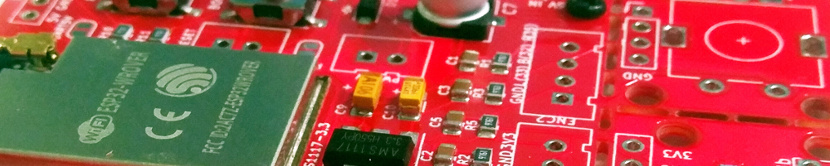
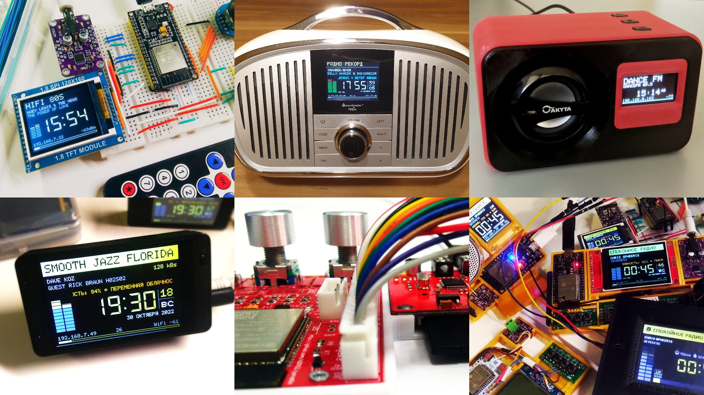
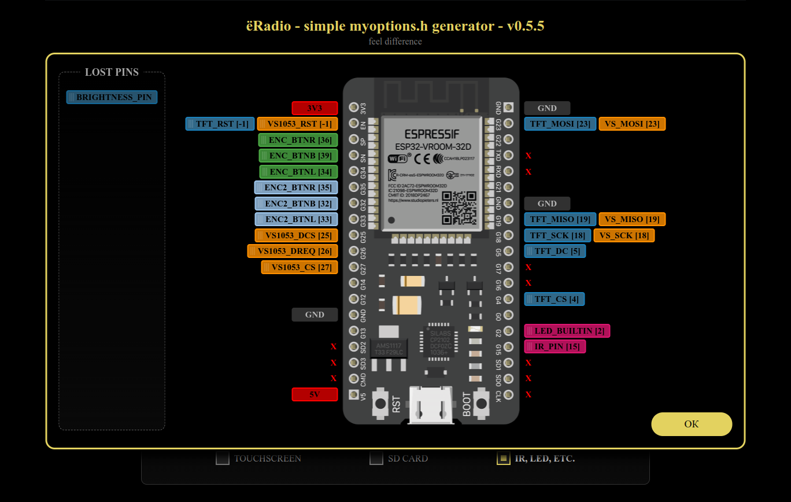

# ёRadio


##### Web-radio based on [ESP32-audioI2S](https://github.com/schreibfaul1/ESP32-audioI2S) or/and [ESP32-vs1053_ext](https://github.com/schreibfaul1/ESP32-vs1053_ext) library
---
- [Hardware](#hardware)
- [Connection tables](#connection-tables)
- [Software dependencies](#dependencies)
- [Hardware setup](#hardware-setup)
- [Quick start](#quick-start)
- [Detailed start](https://github.com/e2002/yoradio/wiki/How-to-flash)
- [Update](#update)
- [Update over web-interface](#update-over-web-interface)
- [Controls](Controls.md)
- [MQTT](#mqtt)
- [Home Assistant](#home-assistant)
- [More features](#more-features)
- [Plugins](#plugins)
- [Version history](#version-history)
- [Описание на 4PDA](https://4pda.to/forum/index.php?s=&showtopic=1010378&view=findpost&p=112992611)
---
#### NEW!
##### yoRadio Printed Circuit Boards repository:
[](https://github.com/e2002/yopcb)

https://github.com/e2002/yopcb

---


##### More images in [Images.md](Images.md)

---
## Hardware
#### Required:
**ESP32 board**: https://aliexpress.com/item/32847027609.html \
**I2S DAC**, roughly like this one: https://aliexpress.com/item/1005001993192815.html \
https://aliexpress.com/item/1005002011542576.html \
or **VS1053b module** : https://aliexpress.com/item/32893187079.html \
https://aliexpress.com/item/32838958284.html \
https://aliexpress.com/item/32965676064.html

#### Optional:
##### Displays
- **ST7735** 1.8' or 1.44' https://aliexpress.com/item/1005002822797745.html
- or **SSD1306** 0.96' 128x64 I2C https://aliexpress.com/item/1005001621806398.html
- or **SSD1306** 0,91' 128x32 I2C https://aliexpress.com/item/32798439084.html
- or **Nokia5110** 84x48 SPI https://aliexpress.com/item/1005001621837569.html
- or **ST7789** 2.4' 320x240 SPI https://aliexpress.com/item/32960241206.html
- or **ST7789** 1.3' 240x240 SPI https://aliexpress.com/item/32996979276.html
- or **SH1106** 1.3' 128x64 I2C https://aliexpress.com/item/32683094040.html
- or **LCD1602** 16x2 I2C https://aliexpress.com/item/32305776560.html
- or **LCD1602** 16x2 without I2C https://aliexpress.com/item/32305776560.html
- or **SSD1327** 1.5' 128x128 I2C https://aliexpress.com/item/1005001414175498.html
- or **ILI9341** 3.2' 320x240 SPI https://aliexpress.com/item/33048191074.html
- or **ILI9341** 2.8' 320x240 SPI https://aliexpress.com/item/1005004502250619.html
- or **SSD1305 (SSD1309)** 2.4' 128x64 SPI/I2C https://aliexpress.com/item/32950307344.html
- or **SH1107** 0.96' 128x64 I2C https://aliexpress.com/item/4000551696674.html
- or **GC9106** 0.96' 160x80 SPI (looks like ST7735S, but it's not him) https://aliexpress.com/item/32947890530.html
- or **LCD2004** 20x4 I2C https://aliexpress.com/item/32783128355.html
- or **LCD2004** 20x4 without I2C https://aliexpress.com/item/32783128355.html
- or **ILI9225** 2.0' 220x176 SPI https://aliexpress.com/item/32952021835.html
- or **Nextion displays** - [more info](https://github.com/e2002/yoradio/tree/main/nextion)
- or **ST7796** 3.5' 480x320 SPI https://aliexpress.com/item/1005004632953455.html?sku_id=12000029911293172
- or **GC9A01A** 1.28' 240x240 https://aliexpress.com/item/1005004069703494.html?sku_id=12000029869654615
- or **ILI9488** 3.5' 480x320 SPI https://aliexpress.com/item/1005001999296476.html?sku_id=12000018365356570
- or **ILI9486** (Testing mode) 3.5' 480x320 SPI https://aliexpress.com/item/1005001999296476.html?sku_id=12000018365356568
- or **SSD1322** 2.8' 256x64 SPI https://aliexpress.com/item/1005003480981568.html
- or **ST7920** 2.6' 128x64 SPI https://aliexpress.com/item/32699482638.html

(see [Wiki](https://github.com/e2002/yoradio/wiki/Available-display-models) for more details)

##### Controls
- Three tact buttons https://www.aliexpress.com/item/32907144687.html
- Encoder https://www.aliexpress.com/item/32873198060.html
- Joystick https://aliexpress.com/item/4000681560472.html \
https://aliexpress.com/item/4000699838567.html
- IR Control https://www.aliexpress.com/item/32562721229.html \
https://www.aliexpress.com/item/33009687492.html
- Touchscreen https://aliexpress.com/item/33048191074.html

##### RTC
- DS1307 or DS3231 https://aliexpress.com/item/4001130860369.html

---
## Connection tables
##### Use [this tool](https://e2002.github.io/docs/myoptions-generator.html) to build your own connection table and myoptions.h file.
<br />

https://e2002.github.io/docs/myoptions-generator.html

---
## Dependencies
#### Libraries:
**Library Manager**: Adafruit_GFX, Adafruit_ST7735\*, Adafruit_SSD1306\*, Adafruit_PCD8544\*, Adafruit_SH110X\*, Adafruit_SSD1327\*, Adafruit_ILI9341\*, Adafruit_SSD1305\*, TFT_22_ILI9225\* (\* depending on display model), OneButton, IRremoteESP8266, XPT2046_Touchscreen, RTCLib \
**Github**: ~~[ESPAsyncWebServer](https://github.com/me-no-dev/ESPAsyncWebServer), [AsyncTCP](https://github.com/me-no-dev/AsyncTCP), [async-mqtt-client](https://github.com/marvinroger/async-mqtt-client) (if you need MQTT support)~~ <<< **starting with version 0.8.920, these libraries have been moved into the project, and there is no need to install them additionally.**

#### Tool:
[ESP32 Filesystem Uploader](https://randomnerdtutorials.com/install-esp32-filesystem-uploader-arduino-ide/)

**See [wiki](https://github.com/e2002/yoradio/wiki/How-to-flash#preparing) for details**

---
## Hardware setup
Don't edit the options.h! \
Hardware is adjustment in the **[myoptions.h](examples/myoptions.h)** file.

**Important!**
You must choose between I2S DAC and VS1053 by disabling the second module in the settings:
````c++
// If I2S DAC used:
#define I2S_DOUT      27
#define VS1053_CS     255
// If VS1053 used:
#define I2S_DOUT      255
#define VS1053_CS     27
````
Define display model:
````c++
#define DSP_MODEL  DSP_ST7735 /*  default - DSP_DUMMY  */
````
The ST7735 display submodel:
````c++
#define DTYPE INITR_BLACKTAB // 1.8' https://aliexpress.ru/item/1005002822797745.html
//#define DTYPE INITR_144GREENTAB // 1.44' https://aliexpress.ru/item/1005002822797745.html
````
Rotation of the display:
````c++
#define TFT_ROTATE 3 // 270 degrees
````
##### Note: If INITR_BLACKTAB dsp have a noisy line on one side of the screen, then in Adafruit_ST7735.cpp:
````c++
  // Black tab, change MADCTL color filter
  if ((options == INITR_BLACKTAB) || (options == INITR_MINI160x80)) {
    uint8_t data = 0xC0;
    sendCommand(ST77XX_MADCTL, &data, 1);
    _colstart = 2; // ← add this line
    _rowstart = 1; // ← add this line
  }
````

---
## Quick start
<br />

- <span style="color: red; font-weight: bold; font-size: 22px;text-decoration: underline;">Arduino IDE version 2.x.x is not supported. Use Arduino IDE 1.8.19</span>
- <span style="color: red; font-weight: bold; font-size: 22px;text-decoration: underline;">ESP32 core version 2.0.0 or higher is [required](https://github.com/espressif/arduino-esp32)!</span>
1. Generate a myoptions.h file for your hardware configuration using [this tool](https://e2002.github.io/docs/myoptions-generator.html).
2. Put myoptions.h file next to yoRadio.ino.
3. Replace file Arduino/libraries/Adafruit_GFX_Library/glcdfont.c with file [yoRadio/fonts/glcdfont.c](yoRadio/fonts/glcdfont.c)
4. Restart Arduino IDE.
5. In ArduinoIDE - upload sketch data via Tools→ESP32 Sketch Data Upload ([it's here](images/board2.jpg))
6. Upload the sketch to the board
7. Connect to yoRadioAP access point with password 12345987, go to http://192.168.4.1/ configure and wifi connections.  \
_\*this step can be skipped if you add WiFiSSID WiFiPassword pairs to the [yoRadio/data/data/wifi.csv](yoRadio/data/data/wifi.csv) file (tab-separated values, one line per access point) before uploading the sketch data in step 1_
8. After successful connection go to http://\<yoipaddress\>/ , add stations to playlist (or import WebStations.txt from KaRadio)
9. Well done!

**See [wiki](https://github.com/e2002/yoradio/wiki/How-to-flash#build--flash) for details**

---
## Update
1. Backup your settings: \
download _http://\<yoradioip\>/data/playlist.csv_ and _http://\<yoradioip\>/data/wifi.csv_ and place them in the yoRadio/data/data/ folder
2. In ArduinoIDE - upload sketch data via Tools→ESP32 Sketch Data Upload
3. Upload the sketch to the board
4. Go to page _http://\<yoradioip\>/_ in the browser and press Ctrl+F5 to update the scripts.
5. Well done!

## Update over web-interface
1. Backup your settings: \
download _http://\<yoradioip\>/data/playlist.csv_ and _http://\<yoradioip\>/data/wifi.csv_ and place them in the yoRadio/data/data/ folder
2. Get firmware binary: Sketch → Export compiled binary
3. Get SPIFFS binary: disconnect ESP32 from your computer, click on **ESP32 Data Sketch Upload**. \
 You will get an error and file path

 

4. Go to page _http://\<yoradioip\>/update_ and upload yoRadio.ino.esp32.bin and yoRadio.spiffs.bin in turn, checking the appropriate upload options.
5. Well done!

---
## MQTT
1. Copy file examples/mqttoptions.h to yoRadio/ directory
2. In the mqttoptions.h file, change the options to the ones you need
3. Well done!

---
## Home Assistant
<br />

0. Requires [MQTT integration](https://www.home-assistant.io/integrations/mqtt/)
1. Copy directory HA/custom_components/yoradio to .homeassistant/custom_components/
2. Add yoRadio entity into .homeassistant/configuration.yaml ([see example](HA/example_configuration.yaml))
3. Restart Home Assistant
4. Add Lovelace Media Player card to UI (or [mini-media-player](https://github.com/kalkih/mini-media-player) card)
5. Well done!

---
## More features
- Can add up to 65535 stations to a playlist. Supports and imports [KaRadio](https://github.com/karawin/Ka-Radio32) playlists (WebStations.txt)
- Telnet with KaRadio format output \
  **see [list of available commands](https://github.com/e2002/yoradio/wiki/List-of-available-commands-(UART-telnet-GET-POST))**

- MQTT support \
 **Topics**: \
 **MQTT_ROOT_TOPIC/command**     - Commands \
 **MQTT_ROOT_TOPIC/status**      - Player status \
 **MQTT_ROOT_TOPIC/playlist**    - Playlist URL \
 **MQTT_ROOT_TOPIC/volume**      - Current volume \
 **Commands**: \
 **prev**          - prev station \
 **next**          - next station \
 **toggle**        - start/stop playing \
 **stop**          - stop playing \
 **start, play**   - start playing \
 **boot, reboot**  - reboot \
 **volm**          - step vol down \
 **volp**          - step vol up \
 **vol x**         - set volume \
 **play x**        - play station x

- Home Assistant support

---
## Plugins
There is no documentation yet, you will have to deal with the examples, which is in directory [examples/plugins/](https://github.com/e2002/yoradio/tree/main/examples/plugins).\
Work is in progress...

---
## Version history
#### v0.9.259
- fixed a hang bug when switching to SD mode after removing the SD
- fixed a hangup error when the connection to the stream was lost in WEB mode

#### v0.9.250
- added support for DS1307 or DS3231 RTC module (you need to install the RTCLib library in the library manager)
- setup
```
#define RTC_MODULE	DS3231	/* or DS1307	*/
#define RTC_SDA       <pin>
#define RTC_SCL       <pin>
```

#### v0.9.242
- fixed a hang bug when scrolling through an SD playlist with an encoder in configurations with VS1053B
- fixed a hang bug when quickly switching SD / WEB modes from the WEB interface in configurations with VS1053B
- fixes in the logic of work

#### v0.9.236
- fix compilation error 'class NetServer' has no member named 'resetQueue'

#### v0.9.235
- SD card playlist moved from SPIFFS to SD card
- new parameter #define SD_MAX_LEVELS - Search depth for files on SD card
- fixed bugs with SD card in multi-threaded mode

#### v0.9.220
- fixed SD prelist indexing error when switching Web>>SD
- fixed a bug of switching to the next track when accidentally playing SD
- fixed import of large playlists (tried). PS: import playlist size is limited by SPIFFS size (SPIFFS.totalBytes()/100*65-SPIFFS.usedBytes() = approximately 60kb )
- new url parameter - http://YPRADIOIP/?clearspiffs - for clearing tails from SD playlist
- optimization of the issuance of the WEB-interface
- brought back the functionality of the track slider
- fixing bugs in the application logic

#### v0.9.201
- fixed a bug when importing a playlist

#### v0.9.200
**!!! a [full update](#update-over-web-interface) with Sketch data upload is required. After updating please press CTRL+F5 in browser !!!**
- implementation of WEB/SD mode switching without reboot
- replacement of SD cards without turning off the power
- switching WEB / SD from the web interface. full update required, including SPIFFS Data
- fixing the Home Assistant integration behavior logic
- SD_HSPI parameter now works. Pins HSPI - 13(MOSI) 12(MISO) 14(CLK)
- new parameter SD_SPIPINS. ```#define SD_SPIPINS sck, miso, mosi```
- sck, miso, mosi - any available pins. Used for "TTGO Tm Music Album" boards ```#define SD_SPIPINS 14, 2, 15```
- fixed a bug with garbage appearing on display ILI9225
- the slider for moving along the SD track is temporarily not working.
- bug fixes

#### v0.9.180
- OneButton library moved to the project

#### v0.9.177
- fixed bitrate display error when playing SD on VS1053B modules

#### v0.9.174
- added forced shutdown of smartstart when WebSocket freezes on problem stations
- added bitrate icon when playing files from SD card
- fix html markup errors

#### v0.9.161
- fixed errors 403 Account already in use, 401 Authorization required
- fixed bitrate icon overflow bug
- fix html markup errors

#### v0.9.156
- fixed bug of random change of playback location when playing files from SD card

#### v0.9.155
- added bitrate badget for displays ST7789, ST7796, ILI9488, ILI9486, ILI9341, ILI9225 and ST7735(BLACKTAB)
  (disable: #define BITRATE_FULL false)
- fixed a bug with garbage appearing on display ILI9225

#### v0.9.143
- fixed NOKIA5110 display invert/off bug

#### v0.9.142
- fixed a bug with smartstart playback when the power is turned off

#### v0.9.141
- fixed error reconnecting to WiFi when connection is lost
- ADDED a compilation error when choosing a board other than "ESP32 Dev Module" or "ESP32 Wrover Module"

#### v0.9.130
- fixed crash in configurations with NOKIA5110 displays
- fixed bug with displaying buffer indicator when switching audioinfo
- fixed bug with displaying the buffer indicator when the connection is lost
- fixed bug of MUTE_PIN failure when connection is lost
- other minor fixes

#### v0.9.122
- fixed a bug in the operation of SSD1305 displays
- fixed bug in operation of LCD1602/2004 displays
- fixed errors in Serial Monitor output

#### v0.9.110
- optimization and bug fixes (display, player, netserver, telnet. mqtt)

#### v0.9.084
- monospace fonts for clock on TFT displays. Fonts can be restored to their original form by adding the ```#define CLOCKFONT_MONO false``` parameter to the myoptions.h file
- new parameter ```#define COLOR_CLOCK_BG R,G,B``` - color of inactive clock segments

#### v0.9.058
- added support for ST7920 128x64 2.6' OLED display https://aliexpress.com/item/32699482638.html

#### v0.9.045
- added support for SSD1322 256x64 2.8' OLED display https://aliexpress.com/item/1005003480981568.html

#### v0.9.022
- optimization of the display of the list of stations
- now the playlist size can be changed with one parameter in the yoRadio/src/displays/conf/display<span>_XXXX_</span>conf.h file --> _const ScrollConfig playlistConf_ param #3
- fixed fonts for ILI9225 display
- fixes in Nextion displays
- bug fixes (including BUFFER FILLED IN 403 MS)

#### v0.9.001
- fixed compilation error netserver.cpp:63:28 for some configurations

#### v0.9.000
- added WEB Board Uploader. ESP32 Filesystem Uploader is no longer needed, the initial setup can be done in the browser. (see [wiki](https://github.com/e2002/yoradio/wiki/WEB-Board-Uploader) for more info)
- fixed error getting weather for some locations

#### v0.8.990
- fixed error displaying access point credentials when DSP_INVERT_TITLE is false
- fixed compilation error for OLED displays when DSP_INVERT_TITLE is false

#### v0.8.988
- **DSP_INVERT_TITLE** now works for all displays when assigned
   ```#define DSP_INVERT_TITLE false```
   the display title takes on a "classic" look (light letters on a dark background)
- advanced weather display - wind direction and strength, feels like
- sea level pressure changed to surface pressure
- added degree icon [\*ps]
- displaying the WiFi signal level in graphical form [\*ps]

[\*ps] - **glcdfont.c** from the **Adafruit_GFX_Library** library has been changed to add new icons, so for the correct display of all this, you need to replace the specified file in the Adafruit_GFX library with the file from the yoRadio/fonts/ folder

#### v0.8.962
- fixed reboot error after sending media from Home Assistant
- fixed bug when playing media from Home Assistant for VS1053
- fix grammar errors

#### v0.8.950
- added support for remote media playback from Home Assistant (Local Media, Radio Browser, TTS)

#### v0.8.933 (homeassistant component)
- HA component >> fixed bugs of getting and generating a playlist

#### v0.8.933
- added support for ILI9488 display
- added support for ILI9486 display in testing mode

#### v0.8.920
**!!! a [full update](#update-over-web-interface) with Sketch data upload is required. After updating please press CTRL+F5 in browser !!!** \
**Please backup playlist.csv and wifi.csv before updating.**
- fixed bug with displaying horizontal scroll in playlist
- fixed compilation error with IR_PIN=255
- libraries async-mqtt-client, AsyncTCP, ESPAsyncWebServer moved to the project
- new parameter #define XTASK_MEM_SIZE - buffer size for AsyncTCP task (4096 by default)

#### v0.8.901
**!!! a [full update](#update-over-web-interface) with Sketch data upload is required. After updating please press CTRL+F5 in browser !!!** \
**Please backup playlist.csv and wifi.csv before updating.**
- added SD Card support (more info in [connection table](#connection-tables) and [examples/myoptions.h](https://github.com/e2002/yoradio/blob/main/examples/myoptions.h))
- added MODE button to switch SD/WEB modes (more info in [Controls.md](https://github.com/e2002/yoradio/blob/main/Controls.md))
- asterisk on the remote control now switches SD/WEB modes
- double click BTN_CENTER and ENC_BTNB now toggles SD/WEB modes
- bug fixes

#### v0.8.173
- bootlog added
- fixed work of start/stop button in configurations with DSP_DUMMY

#### v0.8.138
- fixed unclosed comment in examples/myoptions.h

#### v0.8.137
- fixed compilation error without encoder

#### v0.8.135
- added numeric IR remote buttons in configurations with DSP_DUMMY
- fixed navigation bug in playlist with more than 255 stations
- fixed work of encoders in configurations with DSP_DUMMY
- fixed missing volume value bug when switching to volume control dialog
- LED_BUILTIN is now 255 by default (off)

#### v0.8.112
- fixed compilation error with BOOMBOX_STYLE parameter
- fixes in default configuration for GC9A01A display

#### v0.8.100
- added support for GC9A01A display https://aliexpress.com/item/1005004069703494.html?sku_id=12000029869654615

#### v0.8.089
- increased length of SSID string to 30 characters (requires full update + ESP32 Data Upload)
- fixed artifacts when adjusting the volume on OLED displays
- fixed bug with missing current station in playlist on OLED displays
- new parameter DSP_INVERT_TITLE - invert colors in station name for OLED displays (more details in examples/myoptions.h)

#### v0.8.03b
- added support for ST7796 display
- added support for capacitive touch GT911
- HSPI bus support added - DSP_HSPI, VS_HSPI, TS_HSPI options More details in examples/myoptions.h
- changed the method of connecting the touchscreen in myoptions.h Now instead of specifying TS_CS, you must specify TS_MODEL (by default TS_MODEL_UNDEFINED) More details in examples/myoptions.h
- new parameters TS_SDA, TS_SCL, TS_INT, TS_RST for GT911 touchscreen
- new parameters LIGHT_SENSOR and AUTOBACKLIGHT - to automatically adjust the brightness of the display. More details in examples/myoptions.h
- new parameter LED_INVERT (true/false) - to invert the behavior of the built-in LED
- fixed bug with extra sign } in humidity value

#### v0.8.02b
- fixed artifacts when displaying the volume level
- changes in mytheme.h . Added colors COLOR_PL_CURRENT, COLOR_PL_CURRENT_BG, COLOR_PL_CURRENT_FILL. Details in [examples/mytheme.h](examples/mytheme.h)

#### v0.8.01b
- fix INITR_MINI160x80 compiling error
- fix ENC_INTERNALPULLUP description in examples/myoptions.h

#### v0.8.00b
- rewritten the display engine
- added the ability to position widgets on the display using configuration files. More info in yoRadio/src/displays/conf/ and here https://github.com/e2002/yoradio/wiki/Widgets
- the VU_PARAMS3 parameter is deprecated. VUmeter configuration is done through yoRadio/src/displays/conf/ configs
- added bitrate display on displays
- added the ability to display the weather on all displays except LCD1602
- examples of plug-ins related to displaying information on the display are outdated and no longer work. The examples have been removed from the examples/plugins folder.
- the structure of the project files has been changed so that I don’t know what.
- localization of information displayed on the display (rus, en). Option L10N_LANGUAGE (EN by default. see examples/myoptions.h for details)
- changes in mytheme.h . Added colors COLOR_STATION_BG, COLOR_STATION_FILL, COLOR_BITRATE
- optimization, refactoring
- bugs fixes
- bugs adding
- probably something else that I forgot .__.

#### v0.7.540
- fixed compilation error when using NEXTION display with DUMMY display

#### v0.7.534
- added control via uart (see [list of commands](https://github.com/e2002/yoradio/wiki/List-of-available-commands-(UART-telnet-GET-POST))). The uart and telnet commands are the same.
- added additional commands
- added control via GET/POST (see [list of commands](https://github.com/e2002/yoradio/wiki/List-of-available-commands-(UART-telnet-GET-POST)))
- fixed clock operation when configured with DSP_DUMMY
- fixed RSSI display in web interface when configured with DSP_DUMMY
- added brightness control/on/off nextion displays from the web interface
- new parameter WAKE_PIN (to wake up esp after sleep command earlier than given time (see examples/myoptions.h and list of commands)
- minor memory optimization

#### v0.7.490
**!!! a [full update](#update-over-web-interface) with Sketch data upload is required. After updating please press CTRL+F5 in browser !!!** \
**Please backup playlist.csv and wifi.csv before updating.**
- fixed playlist break down when saving it
- fixed bug with cropped song titles on single line displays (GC9106, ST7735mini, N5110 etc.)
- netserver - optimization and refactoring
- web interface optimization
- the AUDIOBUFFER_MULTIPLIER parameter is deprecated. New parameter AUDIOBUFFER_MULTIPLIER2. If everything works fine, then it is better not to touch it.
- new setting VS_PATCH_ENABLE (see PS)
- fixing other bugs

_**PS:** A bug was found with the lack of sound on some (not all) green VS1053 boards.
If there is no sound, you need to assign in myoptions_
```
#define VS_PATCH_ENABLE false
```
_On red boards and normally working green boards, nothing else needs to be done._

#### v0.7.414
- fixed non latin long titles of songs error

#### v0.7.402
**!!! a [full update](#update-over-web-interface) with Sketch data upload is required. After updating please press CTRL+F5 in browser !!!** \
**Please backup playlist.csv and wifi.csv before updating.**
- added the ability to themize color displays. Details in [examples/mytheme.h](examples/mytheme.h)
- in this connection, examples of plugins displayhandlers.ino and rssibitrate.ino have been updated
- parameter VU_PARAMS2 is deprecated. New parameter - VU_PARAMS3. Details in [yoRadio/display_vu.h](yoRadio/display_vu.h)
- added deepsleep capability for LCD_I2C and OLED displays
- in this connection, a full update with Sketch data upload is required
- in this connection, example of plugin deepsleep.ino (examples/plugins/deepsleep.ino) have been updated
- some bug fixes

#### v0.7.355
- updating libraries ESP32-audioI2S and ESP32-vs1053_ext to the latest version
- optimization of the web interface during playback
- fixed one js bug. a [full update](#update-over-web-interface) with Sketch data upload is desirable
- plugin example for esp deep sleep when playback is stopped (examples/plugins/deepsleep.ino)

#### v0.7.330
**!!! a [full update](#update-over-web-interface) with Sketch data upload is required. After updating please press CTRL+F5 in browser !!!** \
**Please backup playlist.csv and wifi.csv before updating.**
- added the ability to configure parameters through the [web interface](images/settings.png)
- new parameter BRIGHTNESS_PIN - pin for adjusting the brightness of the display. Details in [examples/myoptions.h](examples/myoptions.h#L105)
- the weather plugin is integrated into the code, the settings are made through the web interface

_**PS:** Due to the change in the storage location of settings in the ESP memory, settings such as:_ \
**smartstart, audioinfo, time zone, IR remote, last volume level, last played station, equalizer** \
_will have to be configured again through the web interface. Please understand and forgive._

#### v0.7.017
- fix initialization of some vs1053b green boards
- fix VU initialization on vs1053b boards

#### v0.7.010
- fixed choppy of sound when volume adjustment
- fixed initialisation of Nextion displays

#### v0.7.000
- added support for Nextion displays ([more info](nextion/README.md))
- fixed work of VU Meter
- fixed time lag when adjusting the volume / selecting a station
- optimization of work with the DSP_DUMMY option
- some bug fixes

#### v0.6.530
- adding VU meter for displays ST7735 160x80, GC9106 160x80, ILI9225 220x176, ST7789 240x240
- TFT_22_ILI9225 library is integrated into the project

#### v0.6.494
- adding VU meter for displays ST7735 160x128, ST7735 128x128, ILI9341 320x240, ST7789 320x240 \
  option ENABLE_VU_METER (see [myoptions.h](examples/myoptions.h) for example) \
  **!!! Important !!!** \
  if you enable this feature on the esp32 wroom, due to lack of memory, you must modify the file Arduino/libraries/AsyncTCP/src/AsyncTCP.cpp \
  **replace the line 221** \
  _xTaskCreateUniversal(_async_service_task, "async_tcp", 8192 * 2, NULL, 3, &_async_service_task_handle, CONFIG_ASYNC_TCP_RUNNING_CORE);_ \
  **with** \
  _xTaskCreateUniversal(_async_service_task, "async_tcp", 8192 / 2, NULL, 3, &_async_service_task_handle, CONFIG_ASYNC_TCP_RUNNING_CORE);_

#### v0.6.450
**!!! a [full update](#update-over-web-interface) with Sketch data upload is required. After updating please press CTRL+F5 in browser !!!**
- adding an IR remote control has been moved to the web-interface (more info in [Controls.md](Controls.md#ir-receiver))
- fixed broken internal DAC on esp32 core 2.0.3 and highest

#### v0.6.400
- fixed compilation errors with esp32 core 2.0.4

#### v0.6.380
**!!! a [full update](#update-over-web-interface) with Sketch data upload is required. After updating please press CTRL+F5 in browser !!!**
- fixed a bug when saving a playlist with special characters in the name and url
- fixed a bug when saving wifi settings with special characters in the name and password
- fixed css bugs

#### v0.6.357
- remove ZERO WIDTH NO-BREAK SPACE (BOM, ZWNBSP) from stream title

#### v0.6.355
- added support for ST7789 1.3' 240x240 SPI displays \
  _!!! Important !!! This display requires further development when used in conjunction with the VS1053 module._ \
  See this link for details https://www.instructables.com/Adding-CS-Pin-to-13-LCD/

#### v0.6.348
- fixed display bugs in the rssibitrate plugin
- fixed some compilation warnings

#### v0.6.345
- fix compilation error in rssibitrate plugin with ILI9225 display

#### v0.6.344
- fixed SPI-display bugs when used with VS1053B module
- added example plugin for analog volume control ([examples/plugins/analogvolume.ino](examples/plugins/analogvolume.ino))
- added example plugin for backlight control depending on playback ([examples/plugins/backlightcontrols.ino](examples/plugins/backlightcontrols.ino))
- added example plugin for replace a RSSI to bitrate information alternately ([examples/plugins/rssibitrate.ino](examples/plugins/rssibitrate.ino))

#### v0.6.320
- fixed ILI9225 display bug when used with VS1053B module
- fixed ILI9225 plugin support

#### v0.6.313
- added support for ILI9225 220x176 SPI displays
- added support for I2S internal DAC, option I2S_INTERNAL (see [myoptions.h](examples/myoptions.h#L111) for example) \
 _(this option worked only with esp32 core version==2.0.0)_
- new option SOFT_AP_REBOOT_DELAY (see [myoptions.h](examples/myoptions.h) for example)
- fixed MQTT connection when WiFi reconnected
- fixed date display for ILI9341 displays
- fixed garbage on volume control with displays ILI9341

#### v0.6.290
- fixed interface blocking error when synchronizing time
- time sync optimization
- new option **SNTP_SERVER**, to set your custom server for synchronization (see [myoptions.h](examples/myoptions.h) for example)

#### v0.6.278
- added support for LCD2004 displays
- added support for SSD1305/SSD1309 I2C displays
- fixed rotation of SH1106 display

#### v0.6.263
- fixed encoder internal pullup

#### v0.6.262
- change encoder library to [ai-esp32-rotary-encoder](https://github.com/igorantolic/ai-esp32-rotary-encoder) (injected to project)
- added new option VOL_ACCELERATION - volume adjustment acceleration by encoder (see [myoptions.h](examples/myoptions.h) for example)
- fixed connection error with http-stations on esp32-core v2.0.3
- fixed css errors (a [full update](#update-over-web-interface) is required)

#### v0.6.250
- added update via web-interface \
 **Attention! Full firmware with chip re-partitioning is required!** see [board setup example](#quick-start)
- fixed choppy when switching stations via Home Assistant

#### v0.6.220
- new option PLAYER_FORCE_MONO (with i2S DAC only)
- change default scroll speed in DSP_NOKIA5110
- improved reconnect to WiFi on connection loss

#### v0.6.210
- fixed choppy playback on DSP_ST7735 displays used with VS1053
- new option PL_WITH_NUMBERS (show the number of station in the playlist)
- fixed compiling error with DSP_DUMMY option
- correction of displays GC9106 and SSD1305

#### v0.6.202
- fixed errors in the operation of the second encoder
- rewrote [plugin example](examples/plugins/displayhandlers.ino)
- fixed compilation errors on macOS #2

#### v0.6.200
- please backup your playlist and wifi settings before updating (export)
- accelerated displays up to ~30fps (everything except LCD)
- corrections/additions in the WEB interface (a [full update](#update) is required)
- rewrote [plugin example](examples/plugins/displayhandlers.ino)
- fixed compilation errors on macOS
- changed the logic of the second encoder (switching to the volume control mode by double click)
- optimization, bug fixes
- probably some other things that I forgot about %)

#### v0.6.120
- added support for GC9106 160x80 SPI displays
- fixed compiling error with DSP_DUMMY option
- fixed compiling error with DSP_1602I2C / DSP_1602 option

#### v0.6.110
- the logic of division by cores has been changed
- fixed choppy playback (again)
- improvements in the stability of the web interface
- increased smoothness of the encoder
- bug fixes
- bug fixes

#### v0.6.012
- fixed choppy playback

#### v0.6.010
- added displays [SSD1327](https://aliexpress.com/item/1005001414175498.html), [ILI9341](https://aliexpress.com/item/33048191074.html), [SSD1305/SSD1309](https://aliexpress.com/item/32950307344.html), [SH1107](https://aliexpress.com/item/4000551696674.html), [1602](https://aliexpress.com/item/32685016568.html)
- added [touchscreen](Controls.md#touchscreen) support
- tasks are divided into cores, now the sound is not interrupted when selecting stations / volume
- increased speed of some displays
- optimization of algorithms, bugs fixes

#### v0.5.070
- added something similar to plugins

#### v0.5.035
- added two buttons BTN_UP, BTN_DOWN
- added the pins for the second encoder ENC2_BTNL, ENC2_BTNB, ENC2_BTNR
- fixed display of playlist with SSD1306 configuration
- improvements in the displays work
- bugs fixes, some improvements

#### v0.5.020
- added support for SSD1306 128x32 I2C displays

#### v0.5.010
- added support for ST7789 320x240 SPI displays
- added support for SH1106 I2C displays
- added support for 1602 16x2 I2C displays
- a little modified control logic
- added buttons long press feature
- small changes in options.h, check the correctness of your myoptions.h file
- bugs fixes

#### v0.4.323
- fixed bug [Equalizer not come visible after go to playlist](https://github.com/e2002/yoradio/issues/1) \
 (a [full update](#update) is required)
- fixed playlist filling error in home assistant component

#### v0.4.322
- fixed garbage in MQTT payload

#### v0.4.320
- MQTT support


#### v0.4.315
- added support for digital buttons for the IR control \
(num keys - enter number of station, ok - play, hash - cancel)
- added buttons for exporting settings from the web interface
- added MUTE_PIN to be able to control the audio output
- fixed js/html bugs (a [full update](#update) is required)

#### v0.4.298
- fixed playlist scrollbar in Chrome (a [full update](#update) is required)

#### v0.4.297
- fix _"Could not decode a text frame as UTF-8"_ websocket error _//Thanks for [Verholazila](https://4pda.to/forum/index.php?s=&showtopic=1010378&view=findpost&p=113551446)_
- fix display of non-latin characters in the web interface
- fix css in Chrome (a [full update](#update) is required)

#### v0.4.293
- IR repeat fix

#### v0.4.292
- added support for IR control
- new options in options.h (ENC_INTERNALPULLUP, ENC_HALFQUARD, BTN_INTERNALPULLUP, VOL_STEP) _//Thanks for [Buska1968](https://4pda.to/forum/index.php?s=&showtopic=1010378&view=findpost&p=113385448)_
- compilation error for module SSD1306 with arduino-esp32 version newest than 2.0.0
- fix compiler warnings in options.h
- fix some compiler warnings

#### v0.4.260
- added control of balance and equalizer for VS1053
- **TFT_ROTATE** and st7735 **DTYPE** moved to myoptions.h

#### v0.4.251
- fixed compilation error bug when using VS1053 together with ST7735

#### v0.4.249
- fix VS1003/1053 reseting
- fix css in Firefox
- fix font in NOKIA5110 display

#### v0.4.248
- added support for VS1053 module _in testing mode_

#### v0.4.210
- added timezone config by telnet
- fix telnet output
- some separation apples and oranges

#### v0.4.199
- excluded required installation of all libraries for displays

#### v0.4.197
- added support for Nokia 5110 SPI displays
- some bugs fixes

#### v0.4.183
- ovol reading bug

#### v0.4.182
- display connection algorithm changed
- added support for myoptions.h file for custom settings

#### v0.4.180
- vol steps 0..256 (in ESP32-audioI2S)

#### v0.4.177
- added support for SSD1306 I2C displays
- fixed broken buttons.
