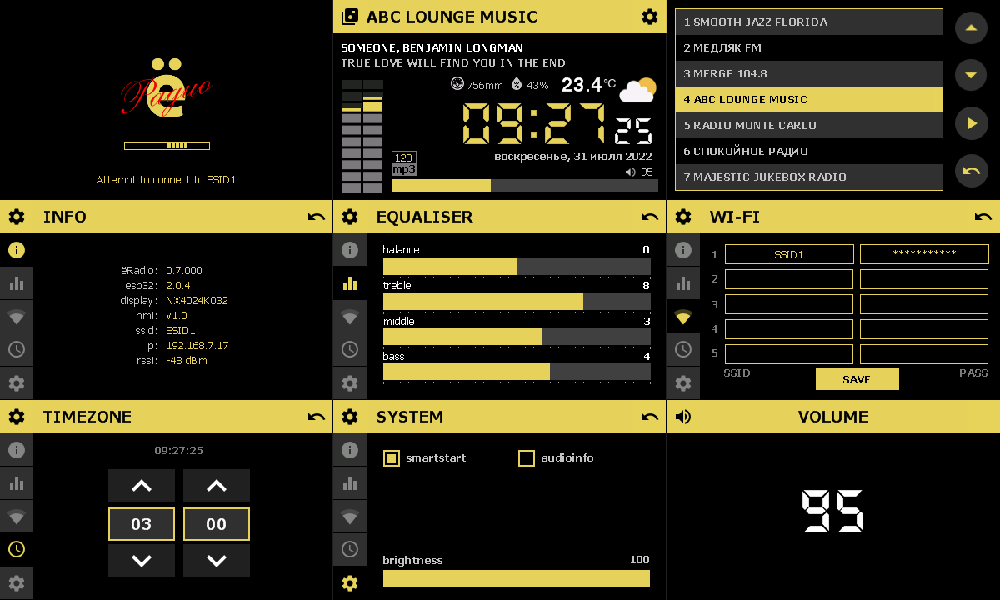

 

#### Tested to work with display models:
- NX4024K032 400x240 3.2' https://aliexpress.com/item/4001118814367.html

#### HOWTO
- Download & install Nextion Editor (ver 1.63.3 or higher) https://nextion.tech/nextion-editor/
- Connect your display to USB port via UART adapter
- Open HMI project and Upload it

#### Connection options for ESP32
- NEXTION_RX - Nextion RX pin (any available GPIO beginning with 13)
- NEXTION_TX - Nextion TX pin (any available GPIO beginning with 13)
- NEXTION_WEATHER_LAT - Nextion latitude for display Weather (e.g "48.8542")
- NEXTION_WEATHER_LON - Nextion longitude for display Weather (e.g "2.3325")
- NEXTION_WEATHER_KEY - Openweathermap API key https://openweathermap.org/appid \
See examples/myoptions.h for details
